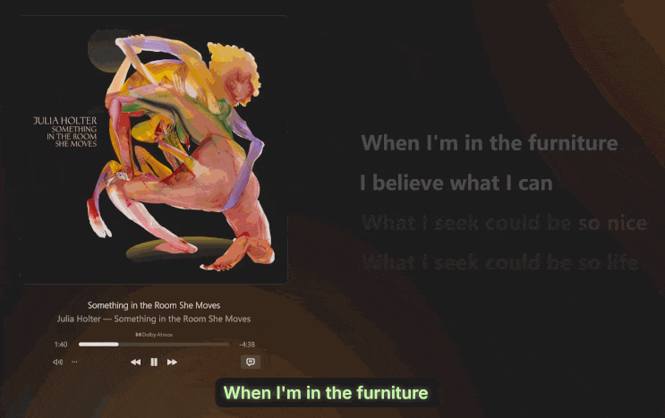

# Apple Music Lyrics

> ⚠️ **Early Development** - This project is in active development. Features and APIs may change.

A lightweight Windows desktop app that displays synchronized lyrics for Apple Music in a floating overlay window.




## Features

- 🎵 **Floating Lyrics Overlay** - Always-on-top window with synchronized lyrics
- 🎨 **Customizable Appearance** - Adjust colors, opacity, fonts, and glow effects
- 📐 **Multiple Display Modes** - Single-line, multi-line, and pure mode
- 🖱️ **Click-Through Mode** - Interact with apps beneath the overlay
- ⚙️ **System Tray Integration** - Minimize to tray with quick access menu
- 🔄 **Auto-Sync** - Automatically syncs with Apple Music playback
- 💾 **Persistent Settings** - Remembers your preferences and window position

## Requirements

- **Windows 10/11** (version 19041 or later)
- **Apple Music** (Windows app)
- **.NET 10 Runtime** - [Download here](https://dotnet.microsoft.com/download/dotnet/10.0)

## Installation

1. Download the latest release from [Releases](../../releases)
2. Extract `AppleMusicLyrics-vX.X.X-win-x64.zip`
3. Run `AppleMusicLyrics.App.exe`

The app will automatically:
- Scan Apple Music's lyric cache
- Detect currently playing songs
- Display synchronized lyrics in the overlay

## Usage

### Basic Controls

- **Show/Hide Overlay** - Right-click tray icon → Show/Hide
- **Move Window** - Drag the overlay to reposition
- **Resize Window** - Drag window edges
- **Settings** - Right-click tray icon → Settings

### Display Modes

- **Multi-line Mode** - Shows previous, current, and next lyrics
- **Single-line Mode** - Shows only the current line
- **Pure Mode** - Minimal UI with no background
- **Click-Through** - Enable to interact with windows beneath the overlay

### Settings

Access settings via tray icon or by clicking the settings button in the overlay:

- **Sync Lead Time** - Adjust timing offset for lyrics synchronization
- **Appearance** - Customize colors, opacity, glow effects
- **Font** - Choose font family, size, and weight
- **Layout** - Configure line spacing and padding

## Development

### Prerequisites

- [.NET SDK 10.0.201](https://dotnet.microsoft.com/download/dotnet/10.0)
- Windows 10/11
- Visual Studio 2022 or VS Code (optional)

### Build

```bash
# Restore dependencies
dotnet restore AppleMusicLyrics.sln

# Build
dotnet build AppleMusicLyrics.sln -c Release

# Run
dotnet run --project src/AppleMusicLyrics.App/AppleMusicLyrics.App.csproj
```

### Test

```bash
dotnet test AppleMusicLyrics.sln -c Release
```

### Publish

```bash
dotnet publish src/AppleMusicLyrics.App/AppleMusicLyrics.App.csproj -c Release -r win-x64 -o artifacts/publish
```

## Project Structure

```
src/
  AppleMusicLyrics.App/              # WPF desktop application
  AppleMusicLyrics.Core/             # Core business logic and models
  AppleMusicLyrics.Infrastructure.Windows/  # Windows-specific integrations
tests/
  AppleMusicLyrics.Tests/            # Unit tests
```

## How It Works

1. **Cache Scanning** - Monitors Apple Music's local lyric cache directory
2. **Media Session** - Reads playback state from Windows Media Session API
3. **TTML Parsing** - Parses Apple's TTML lyric format with timestamps
4. **Synchronization** - Matches current playback position to lyric lines
5. **Rendering** - Displays lyrics in a WPF overlay with smooth transitions

## Known Limitations

- Windows-only (uses Windows Media Session API)
- Requires Apple Music to be installed and running
- Only works with songs that have lyrics in Apple Music
- Lyrics must be cached locally (play the song at least once)

## Roadmap

See [TODO.md](TODO.md) for planned features and improvements.

## Contributing

Contributions are welcome! Please feel free to submit issues or pull requests.

## License

[MIT License](LICENSE) - See LICENSE file for details

## Acknowledgments

Inspired by [LyricsX](https://github.com/ddddxxx/LyricsX) for macOS.
