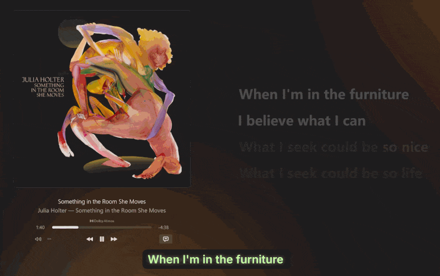

# Apple Music Lyrics

> Early development: features and configuration may change.

A lightweight Windows desktop app that displays synchronized Apple Music lyrics in an always-on-top overlay.




## Features

- Synchronized floating lyrics with single-line, two-line, and context layouts
- Strict Apple Music media-session selection by default
- Confidence-based lyric matching with Apple catalog verification
- Optional LRCLIB fallback when Apple Music has no usable cached lyrics
- Pure Mode with content-sized bounds, configurable drag opacity, and click-through support
- Per-monitor-v2 DPI awareness, mixed-DPI positioning, and independent normal/Pure Mode placement
- Rendering-driven lyric transitions that follow WPF/DWM composition cadence
- Configurable colors, opacity, fonts, glow, timing offset, and visibility behavior
- System tray controls and persistent per-user settings

## Requirements

- Windows 10 version 19041 or later, or Windows 11
- Apple Music for Windows
- x64 [.NET 10 Desktop Runtime](https://dotnet.microsoft.com/download/dotnet/10.0)

The release is framework-dependent; the Desktop Runtime must be installed before starting the app.

## Installation

1. Download `AppleMusicLyrics-vX.X.X-win-x64.zip` from [Releases](../../releases).
2. Extract the archive.
3. Run `AppleMusicLyrics.App.exe`.

Settings and the catalog lookup cache are stored in `%LOCALAPPDATA%\AppleMusicLyrics`. On first launch after upgrading, legacy `settings.ini` and `catalog-cache.json` files beside the executable are copied there when possible.

## Usage

Use the tray icon to show/hide the overlay, open Settings, switch display modes, or toggle click-through behavior. Drag the visible card to move it. Normal mode and Pure Mode retain independent positions.

Important settings include:

- **Lyrics lead time**: calibrates lyrics against audible playback.
- **Apply native timing correction**: honors Apple Music's TTML `lyricOffset` metadata.
- **Compatibility mode**: allows non-Apple media sessions; disabled by default to prevent another player or browser from taking over.
- **Low-confidence candidates**: trades matching accuracy for coverage; disabled by default.
- **Online lyrics**: enables Apple catalog verification and LRCLIB fallback. Changes to these two providers require an app restart.
- **Pure mode drag opacity**: controls visibility while repositioning the card.
- **Debug panel**: shows lyric-resolution evidence plus measured render FPS and player polling rate.

`CompositionTarget.Rendering` normally tracks the WPF/DWM composition cadence of the active display. The debug FPS value measures actual callbacks; it is not a promise that every system or driver will exactly match the monitor's advertised refresh rate.

## Network and privacy

Both online options are enabled by default and can be disabled in Settings for fully offline operation.

- **Apple iTunes Search API**: when local candidates are ambiguous, the app sends title and artist to verify the Apple catalog song ID.
- **LRCLIB**: when Apple Music has no verified local lyrics, the app sends title, artist, album, and duration for exact lookup, with title/artist search fallback.

Requests run in cancellable background operations with bounded retries. The app does not upload lyric cache files. Advanced storefront and timeout values remain available in `%LOCALAPPDATA%\AppleMusicLyrics\settings.ini`.

## How lyric selection works

1. Read Apple Music playback metadata through Windows System Media Transport Controls.
2. Scan Apple Music's local lyric cache and parse timed TTML.
3. Accept a close, unambiguous local match or verify ambiguous candidates against Apple's catalog.
4. Optionally query LRCLIB if no verified local lyrics exist.
5. Keep media/cache/network polling low-frequency while projecting playback and switching lines locally on visual frames.

A missing lyric is preferred over displaying a low-confidence wrong lyric unless the user explicitly enables low-confidence candidates.

## Development

### Prerequisites

- .NET SDK version pinned by [`global.json`](global.json)
- Windows 10/11

### Build and test

```powershell
dotnet restore AppleMusicLyrics.sln
dotnet build AppleMusicLyrics.sln -c Release --no-restore
dotnet test AppleMusicLyrics.sln -c Release --no-build
```

### Run

```powershell
dotnet run --project src/AppleMusicLyrics.App/AppleMusicLyrics.App.csproj
```

### Publish

```powershell
dotnet publish src/AppleMusicLyrics.App/AppleMusicLyrics.App.csproj -c Release -r win-x64 -p:PublishSingleFile=true -o artifacts/publish/win-x64
```

## Project structure

```text
src/
  AppleMusicLyrics.App/                    WPF desktop application
  AppleMusicLyrics.Core/                   Core models and pure logic
  AppleMusicLyrics.Infrastructure.Windows/ Windows integrations
tests/
  AppleMusicLyrics.Tests/                  Unit tests
```

## Known limitations

- Windows-only.
- Apple Music must be running for playback tracking.
- Offline mode requires lyrics already present in Apple Music's local cache.
- Layered transparent WPF windows can show driver-specific edge flicker while Pure Mode resizes; this requires hardware testing across systems.

## Contributing

Issues and pull requests are welcome. Keep matching changes accuracy-first and avoid introducing per-frame media, disk, or network I/O.

## License

Licensed under the [MIT License](LICENSE).

## Acknowledgments

Inspired by [LyricsX](https://github.com/ddddxxx/LyricsX) for macOS.
